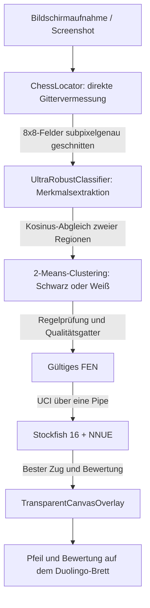

# ♟️ DuLo (Overlay-Schachassistent für Duolingo)

<p align="center">
  <a href="README.md">
    
  </a>
  &nbsp;&nbsp;
  <a href="README_EN.md">
    
  </a>
</p>

<p align="center">
  <a href="https://github.com/risenh/duolingo-chess-copilot/actions/workflows/build-apk.yml">
    
  </a>
  
  
  
  <a href="LICENSE">
    
  </a>
</p>

<p align="center">
  <strong>DuLo ist ein Android-Assistent, der die Stellung im Schachmodus von Duolingo direkt auf dem Bildschirm auswertet.</strong><br>
  Er verbindet eine genaue Vermessung des Bretts per Bildverarbeitung, die eingebettete Stockfish-16-Engine mit NNUE-Netz und ein transparentes Overlay, das den besten Zug als Pfeil über das Brett zeichnet.
</p>

---

## 🌟 Kernfunktionen

- ⚡ **Direkte Vermessung des Gitters in Millisekunden (`ChessLocator`)**
  - Eigene Peaksuche über die Periodizität der Gradienten samt Ausgleichsrechnung: keine Abhängigkeit von einer festen Auflösung oder einem bestimmten Layout;
  - Gleicht Display-Aussparungen, Gestenleisten und verschobene Statusleisten selbstständig aus und trifft das 8×8-Gitter unterhalb eines Pixels genau.
- 🎯 **Sehr robuste Figurenerkennung über zwei Regionen (`UltraRobustClassifier`)**
  - Kosinus-Ähnlichkeit von Kopf- und Körperregion zusammen mit Kantengradienten trennt selbst Bauer, Springer und Dame verlässlich;
  - Adaptives 2-Means-Clustering der Helligkeit bestimmt die Farbe unabhängig von hervorgehobenen Feldern und Farbverläufen;
  - Ein **semantisches Qualitätsgatter** (beide Könige genau einmal, kein Bauer auf Reihe 1/8, Abwertung überzähliger Figuren, Prüfung des FEN) verhindert erfundene Stellungen.
- 🧠 **Stockfish 16 mit NNUE direkt auf dem Gerät**
  - Native C++-Builds für `arm64-v8a`, `armeabi-v7a` und `x86_64`;
  - Das Netz `nn-5af11540bbfe.nnue` liegt im APK, die Kommunikation läuft über das UCI-Protokoll;
  - Liefert Bewertung (Centipawns / Matt), besten Zug und die zweitbeste Antwort.
- 🎨 **Blase am Bildschirmrand, Menü und transparentes Overlay**
  - Der Vordergrunddienst `FloatingBubbleService` zeigt DuLo als frei verschiebbare Blase mit abgerundeten Ecken;
  - ein Tippen öffnet ein kleines Menü mit einem Schalter im Stil der Systemkacheln (**Off** / **On**, animiert) und dem Knopf **Beenden**;
  - `TransparentCanvasOverlay` zeichnet nur den Pfeil und die beiden hervorgehobenen Felder über das Duolingo-Brett, Berührungen gehen hindurch;
  - geht etwas schief, steht dort schlicht **Something went wrong :(** statt einer technischen Fehlertafel.
- 🔁 **Dauerbeobachtung statt Antippen**
  - Beim Einschalten legt DuLo die Seiten fest: was unten auf den beiden Reihen steht, sind die eigenen
    Figuren, oben steht der Gegner. Ob die eigenen hell oder dunkel sind, entscheidet die
    Helligkeitsclusterung - daraus ergibt sich die eigene Farbe, und die bleibt für die Sitzung stehen.
  - Danach zeigt DuLo den besten Zug für die eigene Farbe und wartet;
  - **der eigene Zug wird übersprungen**: führt man die Empfehlung aus, verschwindet der Pfeil und es
    passiert nichts weiter - erst wenn danach eine gegnerische Figur auf einem Feld auftaucht, das
    vorher nicht ihr gehörte, wird die nächste Empfehlung berechnet;
  - dafür verfolgt DuLo **fünfmal pro Sekunde jede Figurenposition**: je Feld werden Streuung (steht
    dort eine Figur?) und Helligkeit (hell oder dunkel?) gelesen, direkt aus dem Frame-Puffer und ohne
    Vollbild-Kopie;
  - der gezeichnete Pfeil stört den Vergleich nicht: die Vergleichsbasis entsteht erst nach dem
    Zeichnen, er steht also in beiden Aufnahmen gleich und hebt sich auf. Gerade die Felder unter dem
    Pfeil sind die wichtigsten, denn dort führt man den empfohlenen Zug aus;
  - die volle Erkennung läuft an, sobald die Figuren zwei Takte lang stillstehen - spätestens aber nach
    rund drei Sekunden, damit dauerhafte Animationen der Oberfläche sie nicht aufhalten;
  - zusätzlich sieht ein Sicherheitsnetz alle paar Sekunden von sich aus nach. Die Engine läuft dabei
    nur, wenn der Gegner wirklich gezogen hat.
- 🔒 **Vollständig offline**
  - Bildverarbeitung und Engine laufen ausschließlich auf dem Gerät, es gibt keine Netzwerkanfragen und keine Datenübertragung.

---

## 📐 Aufbau und Datenfluss



---

## ♟️ Konfiguration der Engine

Die Engine wird beim Handshake auf maximale Spielstärke bei 4 Sekunden Bedenkzeit pro Zug
eingestellt (siehe `StockfishBridge`). Gesetzt wird nur, was die Engine im Handshake als
unterstützte Option meldet; alles andere wird übersprungen und in der Diagnose vermerkt.

| Option              | Wert                                                                            |
|---------------------|---------------------------------------------------------------------------------|
| Threads             | logische Kerne minus 1 (z. B. 15 bei 16 Kernen), mindestens 1                    |
| Hash                | 256 MB bei 4-6, 512 MB bei 8-12, 1024 MB ab 16 logischen Kernen                   |
| MultiPV             | 1                                                                                |
| Ponder              | false                                                                            |
| Skill Level         | 20                                                                               |
| UCI_LimitStrength   | false                                                                            |
| Move Overhead       | 10 ms (die Engine läuft lokal auf dem Gerät)                                      |
| nodestime           | 0                                                                                |
| UCI_ShowWDL         | true                                                                             |
| NumaPolicy          | auto                                                                             |
| SyzygyPath          | nur gesetzt, wenn unter `filesDir/syzygy` Tablebases liegen                       |
| SyzygyProbeDepth    | 1 (nur mit Tablebases)                                                            |
| SyzygyProbeLimit    | 5 (nur mit Tablebases)                                                            |
| Syzygy50MoveRule    | true (nur mit Tablebases)                                                         |
| Suchbefehl          | `go movetime 4000`; `ucinewgame` nur zu Beginn einer neuen Partie                 |

Weitere Punkte der Vorgabe:

- **Passende Binary**: Liegen im APK neben `libstockfish.so` weitere Varianten
  (`libstockfish-vnni512.so`, `-bmi2`, `-avx2`, `-armv8-i8mm`, `-armv8-dotprod`), wählt die App
  anhand der Merkmale aus `/proc/cpuinfo` die stärkste passende aus. Aktuell liefert das Projekt
  nur die generische Variante je ABI mit; wer die Binaries selbst baut, kann die Varianten einfach
  unter diesen Namen dazulegen.
- **Hash-Nachregelung**: Meldet die Engine über mehrere Suchen im Mittel mehr als 30 Prozent
  `hashfull`, verdoppelt die App den Hash (höchstens auf das Vierfache des Ausgangswerts).
- **Transpositionstabelle bleibt warm**: `ucinewgame` läuft nur beim Beginn einer neuen Partie
  (ab 28 Figuren auf dem Brett). Innerhalb einer Partie ist die nächste Stellung die Fortsetzung der
  vorherigen; die gespeicherten Bewertungen passen weiter und ersparen der Suche viel Arbeit. Sie bei
  jedem Zug wegzuwerfen kostet spürbar Spielstärke.
- **Speichergrenze des Geräts**: Der Tabellenwert wird auf ein Viertel des physischen
  Arbeitsspeichers gedeckelt. Ohne diese Grenze beendet Android den Engine-Prozess auf Telefonen
  mit wenig Speicher, was mehr Spielstärke kostet als der kleinere Hash.
- **Große Speicherseiten**: Die Einstellung "Sperren von Seiten im Speicher" gibt es nur unter
  Windows und betrifft diese App nicht. Wer dieselbe Konfiguration auf einem Windows-Rechner fährt,
  sollte das Recht dort für den Benutzer vergeben, damit Stockfish Large Pages nutzen kann.

Ein Hinweis zur Reproduzierbarkeit: Mit mehreren Threads ist die Suche unter `movetime` nicht mehr
deterministisch, zwei Analysen derselben Stellung können also unterschiedliche Züge liefern. Die App
puffert die Ergebnisse je FEN, ein zweiter Klick auf ein unverändertes Brett zeigt deshalb dieselbe
Empfehlung.

---

## 📂 Aufbau des Projekts

```text
├── android_copilot/         # Android-Anwendung (Hauptprojekt)
│   ├── app/src/main/java/   # Quelltext (Locator, Classifier, Dienst, Oberfläche)
│   ├── app/src/main/jniLibs/# Vorkompilierte native Stockfish-Bibliotheken (.so)
│   ├── app/src/main/assets/ # Vorlagenbilder und NNUE-Gewichte
│   └── app/src/test/        # Kotlin-Unit-Tests für Algorithmen und Protokoll
├── test_images/             # Testbilder
│   ├── benchmarks/          # Positive Referenzfälle (duolingo_1~3, duolingo_test_*)
│   ├── bugs/                # Fälle aus gemeldeten Fehlern und Negativbeispiele
│   └── calibration/         # Aufnahmen zur Vermessung des Gitterversatzes
├── tools/                   # Werkzeuge: Vorlagen erzeugen, ONNX exportieren, Kalibrierung
├── docs/                    # Entwürfe und Entwicklungsnotizen
└── archive/                 # Ältere Prototypen und Diagnoseskripte
```

---

## 🚀 Erste Schritte

### Weg 1: fertiges APK herunterladen

1. Die **[Actions-Seite des Repositories](https://github.com/risenh/duolingo-chess-copilot/actions)** öffnen;
2. den letzten erfolgreichen Lauf von **`Build Duolingo Chess Copilot APK`** anklicken;
3. unten unter **Artifacts** das Archiv `Duolingo-Chess-Copilot-APK` herunterladen, entpacken und auf
   einem Android-Gerät (ab Android 8.0) installieren.

### Weg 2: aus den Quellen bauen

Voraussetzungen:
- **JDK 17 oder neuer**
- **Android SDK** (API-Level 34, Min-SDK 26)
- **Git LFS** (sonst wird nur der Zeiger statt der NNUE-Datei geladen)

```bash
# 1. Repository klonen (mit LFS)
git clone https://github.com/risenh/duolingo-chess-copilot.git
cd duolingo-chess-copilot
git lfs pull

# 2. In das Android-Projekt wechseln und bauen
cd android_copilot
./gradlew assembleDebug

# 3. Das fertige APK liegt unter: app/build/outputs/apk/debug/app-debug.apk
```

---

## 📱 Bedienung

1. **Berechtigungen erteilen**: Beim ersten Start die **Overlay-Berechtigung**
   (`SYSTEM_ALERT_WINDOW`) und die **Bildschirmaufnahme** (`MediaProjection`) freigeben.
2. **DuLo starten**: Der Umschalter auf dem Startbildschirm ist das Foto von DuLo. Ein Tippen startet
   den Dienst, das Bild leuchtet dann mit grünem Rahmen; ein weiteres Tippen beendet ihn wieder.
3. **Duolingo öffnen** und ein Schachlevel starten.
4. **Menü öffnen**: Kurz auf die Blase tippen. Es erscheinen:
   - der **Schalter** (steht auf **Off**): ein Tippen schiebt den Knopf animiert nach rechts, die Spur
     wird grün und die Beschriftung wechselt auf **On**. Ab dann wird die Engine sofort gefragt und
     danach jedes Mal erneut, sobald der Gegner gezogen hat. Der Pfeil bleibt stehen, bis der nächste
     Zug erkannt wird. Zurück auf **Off** beendet die Beobachtung und blendet den Pfeil aus.
   - **Beenden**: schließt das Menü und stoppt DuLo samt Bildschirmaufnahme vollständig, so als hätte
     man die App über die Systemeinstellungen beendet.
5. **Farbe umschalten**: Zeigt der Pfeil einmal Züge für die gegnerischen Figuren, schaltet ein
   langer Druck auf die Blase die eigene Farbe um. Diese Einstellung bleibt dann bestehen, bis
   erneut lange gedrückt oder der Dienst neu gestartet wird.

DuLo schreibt keine Screenshots auf die Platte und legt nichts in der Zwischenablage ab; alles bleibt
im Arbeitsspeicher des Geräts.

---

## 🤝 Mitwirken

Issues und Pull Requests sind willkommen. Die Konventionen stehen in [CONTRIBUTING.md](CONTRIBUTING.md).

---

## ⚖️ Haftungsausschluss

1. Dieses Projekt dient dem Lernen und dem fachlichen Austausch über **Bildverarbeitung, lokale
   Inferenz auf Mobilgeräten und Mensch-Maschine-Interaktion**.
2. Es darf nicht in Ranglistenpartien oder auf eine Weise eingesetzt werden, die den
   Nutzungsbedingungen von Duolingo widerspricht. Für Folgen unsachgemäßer Nutzung übernehmen die
   Entwickler keine Verantwortung.
3. Marke und Oberfläche von Duolingo gehören Duolingo, Inc.; die Schach-Engine Stockfish steht unter
   der GPLv3.

---

## 📄 Lizenz

Dieses Projekt steht unter der [MIT-Lizenz](LICENSE).
