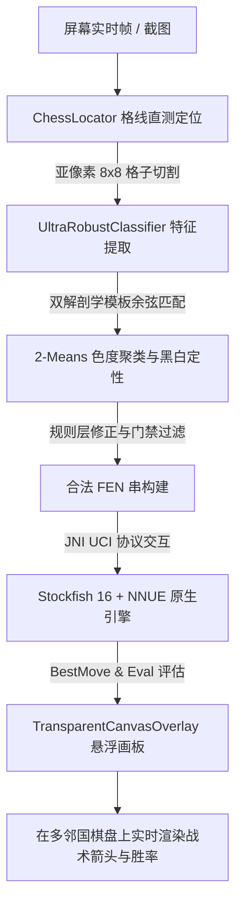

# ♟️ Duolingo Chess Copilot (多邻国国际象棋战术伴侣)

<p align="center">
  <a href="https://github.com/risenh/duolingo-chess-copilot/actions/workflows/build-apk.yml">
    
  </a>
  
  
  
  <a href="LICENSE">
    
  </a>
</p>

<p align="center">
  <strong>专为多邻国国际象棋（Duolingo Chess）量身打造的 Android 实时无感战术辅助工具。</strong><br>
  结合计算机视觉精标定、嵌入式 Stockfish 16 深度神经网络算力与原生悬浮交互，助你洞悉每一步最佳胜着。
</p>

<p align="center">
  <a href="README_EN.md">English</a> •
  <a href="README.md">简体中文</a>
</p>

---

## 🌟 核心特性 (Key Features)

- ⚡ **微秒级屏幕直测定位 (`ChessLocator`)**
  - 自研格线周期性梯度峰值检测与残差回归算法，摆脱对多邻国固定分辨率或特定 UI 布局的依赖；
  - 自动适应异形屏、刘海屏、全屏手势及状态栏动态偏移，8×8 棋盘网格切分精度达到亚像素级。
- 🎯 **超鲁棒双解剖学棋子识别 (`UltraRobustClassifier`)**
  - 结合头部与躯干双区域余弦相似度与边缘梯度特征工程，彻底区分兵/马/后等极易混淆棋子；
  - 自适应 2-Means 色度动态聚类，无惧多邻国落子高亮与棋盘背景明暗渐变；
  - 严格内置**语义质量门禁**（双王唯一性、禁兵行修正、重复子降级与合法 FEN 校验），识别零幻觉。
- 🧠 **原汁原味 Stockfish 16 + NNUE 深度算力**
  - 原生 C++ 编译编译覆盖 `arm64-v8a`、`armeabi-v7a`、`x86_64` 主流架构；
  - 完整打包嵌入 `nn-5af11540bbfe.nnue` 深度神经网络，通过 JNI 高速双向 UCI 协议交互；
  - 毫秒级输出当前局势评估（Centipawns / Mate）、最佳走法（Best Move）与次优应对。
- 🎨 **原生全局悬浮球与透明战术画板**
  - 轻量 Android 悬浮窗服务（`FloatingBubbleService`），支持任意拖拽、一键唤醒分析与静默常驻；
  - 全局透明 Canvas 覆盖层（`TransparentCanvasOverlay`），直接在多邻国棋盘上实时绘制动态战术箭头与着法提示。
- 🔒 **100% 本地纯离线运行**
  - 所有视觉处理与引擎运算均在本地设备完成，零网络请求、零数据上传，彻底保障用户隐私。

---

## 📐 系统架构与数据流 (Architecture)



---

## 📂 项目结构 (Project Structure)

```text
├── android_copilot/         # 【核心工程】Android 原生客户端代码
│   ├── app/src/main/java/   # 核心源码 (Locator, Classifier, FloatingService, UI)
│   ├── app/src/main/jniLibs/# 预编译原生 Stockfish C++ 动态链接库 (.so)
│   ├── app/src/main/assets/ # 模板库与 NNUE 神经网络权重
│   └── app/src/test/        # 核心算法与协议 Kotlin 原生单元测试集
├── test_images/             # 【测试数据集】
│   ├── benchmarks/          # 核心基准正样本 (duolingo_1~3, duolingo_test_*)
│   ├── bugs/                # 真机 Bug 复现用例与负样本
│   └── calibration/         # 棋盘网格偏移量测样本
├── tools/                   # 【常用工具】资源提取、ONNX 转换与模板生成工具
├── docs/                    # 【文档资料】设计方案与开发记录
└── archive/                 # 【历史归档】前期原型探索与诊断脚本
```

---

## 🚀 快速上手 (Getting Started)

### 方式一：直接下载安装 (Pre-built APK)

1. 点击进入仓库的 **[Actions 工作流页面](https://github.com/risenh/duolingo-chess-copilot/actions)**；
2. 点击最新一次成功的 **`Build Duolingo Chess Copilot APK`** 构建记录；
3. 在页面底部的 **Artifacts** 区域下载 `Duolingo-Chess-Copilot-APK` 压缩包，解压后安装至 Android 手机（需 Android 8.0+）。

### 方式二：从源码构建 (Build from Source)

环境要求：
- **JDK 17+**
- **Android SDK** (API Level 34, Min SDK 26)
- **Git LFS**（用于正确拉取 NNUE 神经网络大文件）

```bash
# 1. 克隆本仓库 (确保启用 LFS)
git clone https://github.com/risenh/duolingo-chess-copilot.git
cd duolingo-chess-copilot
git lfs pull

# 2. 进入 Android 工程目录并执行编译
cd android_copilot
./gradlew assembleDebug

# 3. 生成的 APK 位于: app/build/outputs/apk/debug/app-debug.apk
```

---

## 📱 使用指南 (Usage)

1. **授予权限**：首次打开 App，根据系统提示开启 **悬浮窗权限**（`SYSTEM_ALERT_WINDOW`）与 **屏幕截取权限**（`MediaProjection`）。
2. **启动伴侣**：点击「启动悬浮助手」，屏幕边缘将出现悬浮球。
3. **打开多邻国**：启动 Duolingo 并进入国际象棋关卡。
4. **实时分析**：点击悬浮球，即可在棋盘上即时看到最佳着法指引箭头与当前优势分值评估。

---

## 🤝 参与贡献 (Contributing)

欢迎提交 Issue 和 Pull Request 来帮助完善本项目！详细规范请查阅 [CONTRIBUTING.md](CONTRIBUTING.md)。

---

## ⚖️ 免责声明 (Disclaimer)

1. 本项目仅供**计算机视觉、移动端本地推理及人机交互技术**的学习与学术交流使用。
2. 请勿在任何在线排位赛或违背多邻国用户服务条款的环境下滥用本工具，开发者对因使用不当造成的任何后果概不负责。
3. 多邻国（Duolingo）商标及界面版权归 Duolingo, Inc. 所有；Stockfish 国际象棋引擎遵循 GPLv3 协议。

---

## 📄 开源协议 (License)

本项目采用 [MIT License](LICENSE) 授权。
