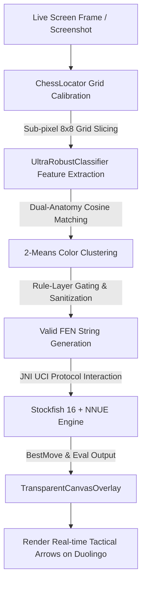

# ♟️ Duolingo Chess Copilot

<p align="center">
  <a href="README.md">
    
  </a>
  &nbsp;&nbsp;
  <a href="README_EN.md">
    
  </a>
</p>

<p align="center">
  <a href="https://github.com/risenh/duolingo-chess-copilot/actions/workflows/build-apk.yml">
    
  </a>
  
  
  
  <a href="LICENSE">
    
  </a>
</p>

<p align="center">
  <strong>An ultra-fast, seamless real-time Android tactical assistant tailored for Duolingo Chess.</strong><br>
  Powered by precision sub-pixel board localization, an ultra-robust piece classifier, embedded Stockfish 16 + NNUE neural network engine, and a lightweight floating overlay.
</p>

---

## 🌟 Key Features

- ⚡ **Microsecond Direct Grid Scale Localization (`ChessLocator`)**
  - Gradient peak periodicity detection + residual regression algorithms eliminating reliance on fixed resolutions or specific device aspect ratios;
  - Automatically compensates for notches, gesture navigation bars, and status bar offsets with sub-pixel 8×8 grid accuracy.
- 🎯 **Ultra-Robust Dual-Anatomy Piece Classifier (`UltraRobustClassifier`)**
  - Combines head & body cosine similarity matching with edge gradient features to effortlessly distinguish tricky pieces (e.g. Pawn vs. Knight vs. Queen);
  - Adaptive 2-Means dynamic clustering ensures accurate black/white color identification regardless of tile highlights or gradient backgrounds;
  - Built-in **semantic quality gating** (dual-king validation, rank 1/8 pawn bans, duplicate piece demotion, and valid FEN verification) guaranteeing zero hallucination.
- 🧠 **Embedded Stockfish 16 + NNUE Neural Evaluation**
  - Native C++ engine builds supporting `arm64-v8a`, `armeabi-v7a`, and `x86_64` architectures;
  - Bundled with the official `nn-5af11540bbfe.nnue` neural network weights via high-speed JNI UCI protocol;
  - Millisecond-level position evaluation (Centipawns / Mate) and best-move recommendations.
- 🎨 **Native Floating Bubble & Transparent Canvas Overlay**
  - Lightweight background service (`FloatingBubbleService`) for draggable one-tap tactical analysis;
  - Transparent overlay canvas (`TransparentCanvasOverlay`) rendering live dynamic arrows directly over the Duolingo board.
- 🔒 **100% On-Device & Offline**
  - Purely offline computer vision and engine computation. No data collection, zero network requests.

---

## 📐 Architecture Pipeline



---

## 📂 Project Structure

```text
├── android_copilot/         # [Core] Android Native App Project
│   ├── app/src/main/java/   # Core source code (Locator, Classifier, FloatingService, UI)
│   ├── app/src/main/jniLibs/# Pre-compiled native Stockfish C++ libraries (.so)
│   ├── app/src/main/assets/ # Template assets and NNUE neural network weights
│   └── app/src/test/        # Unit test suite for locator, FEN builder, and UCI parser
├── test_images/             # [Dataset]
│   ├── benchmarks/          # Core positive benchmark ground truth images
│   ├── bugs/                # Real-world bug test cases & negative UI samples
│   └── calibration/         # Board scale & offset calibration images
├── tools/                   # [Utilities] Template generation, Stockfish extraction, ONNX tools
├── docs/                    # [Documentation] Architecture & design documents
└── archive/                 # [Archive] Legacy prototypes and inspection scripts
```

---

## 🚀 Getting Started

### Option 1: Download Pre-built APK

1. Go to the repository's **[Actions Page](https://github.com/risenh/duolingo-chess-copilot/actions)**;
2. Select the latest successful **`Build Duolingo Chess Copilot APK`** workflow run;
3. Scroll down to the **Artifacts** section, download and install `Duolingo-Chess-Copilot-APK` on your Android device (Android 8.0+).

### Option 2: Build from Source

Requirements:
- **JDK 17+**
- **Android SDK** (API Level 34, Min SDK 26)
- **Git LFS** (Required to pull the NNUE weights properly)

```bash
# 1. Clone the repository with Git LFS
git clone https://github.com/risenh/duolingo-chess-copilot.git
cd duolingo-chess-copilot
git lfs pull

# 2. Build Debug APK with Gradle
cd android_copilot
./gradlew assembleDebug

# 3. Output APK location: app/build/outputs/apk/debug/app-debug.apk
```

---

## 📱 Permissions & Usage

1. **Grant Permissions**: Grant **Overlay Permission** (`SYSTEM_ALERT_WINDOW`) and **Screen Capture Permission** (`MediaProjection`) on first launch.
2. **Start Copilot**: Tap "Start Copilot" to display the floating bubble.
3. **Open Duolingo**: Launch Duolingo and enter any chess lesson or game.
4. **Instant Analysis**: Tap the floating bubble to instantly view best moves and evaluation arrows.

---

## 🤝 Contributing

Contributions, bug reports, and feature requests are welcome! Please check out [CONTRIBUTING.md](CONTRIBUTING.md) for details.

---

## ⚖️ Disclaimer

1. This project is developed strictly for **educational and research purposes** in computer vision, on-device neural inference, and UI interaction design.
2. Please do not misuse this tool in competitive ranked games or in violation of Duolingo Terms of Service.
3. Duolingo is a registered trademark of Duolingo, Inc. The Stockfish chess engine is licensed under GPLv3.

---

## 📄 License

This project is licensed under the [MIT License](LICENSE).
